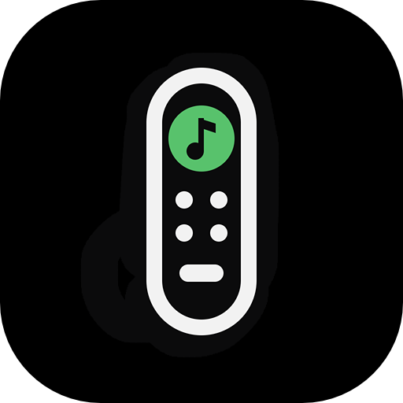

    
    <h1>ReMate</h1>

ReMate is a Spotify Remote control for Spotify Connect using Spotify API.

NB. This app requires premium Spotify account as needs developer account setup required for Web API.

The app does not have access to you playlists/songs/etc. It can only control what's being played and alllows you to control the player. It can't switch to non-active Spotify Connect devices such as phones and laptop if Spotify is not running on them. It switch to Echo speakers though.

<!--  -->

## Install

### Manual Installation

Download the "ReMate 1.01.dmg" file from the [latest release](https://github.com/tbrek/ReMate-Releases/releases/) double click dmg files the app into your `Applications` folder.

### ReMate features:

- Controls Spotify Connect devices via web API
- Can be docked in Menu Bar or float on the screen
- Can be set as Always on Top for "Always-on" control
- It has two screen modes - mini and large (normal)
- It can be set to Dark/Light or Auto modes

### Setup

- Visit [Spotify for Developers](https://developer.spotify.com)
- Login and go to your [Dashboard](https://developer.spotify.com/dashboard)
- Click Create app and fill the following details as per screenshot:

- When you click save you'll see confirmation screen with you Client ID

- Copy client ID and close then browser window
- Open ReMate and you'll be asked to enter Client ID and login to Spotify
- You'll be asked to Authorize ReMate with Spotify

## Gallery

#### Mini Remote

#### Large Remote

#### Mini Docked Remote

#### Large Docked Remote

#### Client ID setup window

## License

Ice is available under the [GPL-3.0 license](LICENSE).